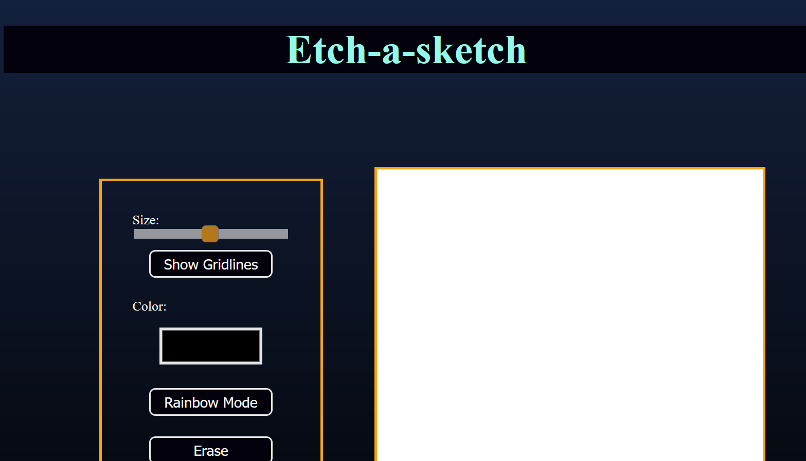

# Etch-a-Sketch

## Overview

Etch-a-Sketch is a digital version of the classic drawing toy, created using pure HTML, CSS, and JavaScript. The application allows users to draw on a grid-based canvas, adjust grid sizes, and clear the canvas.



## Features

- **User Interface:** A clean and intuitive layout designed with HTML and CSS, featuring a grid-based drawing area.
- **Drawing Functionality:** JavaScript enables real-time drawing on the grid and handles user interactions.
- **Grid Adjustment:** Users can resize the grid to customize their drawing space.
- **Canvas Clearing:** Option to clear the canvas and start a new drawing.
- **Responsive Design:** Ensures the application works well on various devices and screen sizes.

## How to Use

1. **Draw:** Move your mouse over the grid to draw.
2. **Resize Grid:** Use the controls to adjust the grid size according to your preference.
3. **Clear Canvas:** Click the clear button to reset the drawing area.

## Installation

1. Clone the repository:
   ```bash
   git clone https://github.com/your-username/etch-a-sketch.git
